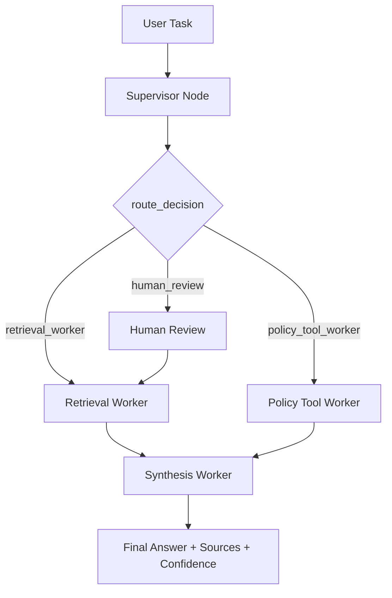

# System Architecture — Lab Day 09

**Nhóm:** Day09 Team  
**Ngày:** 14/04/2026  
**Version:** 1.1

---

## 1. Tổng quan kiến trúc

**Pattern đã chọn:** Supervisor-Worker

Hệ thống được tổ chức theo mô hình orchestration nhiều worker:
- Entry point là `run_graph(task)` trong `graph.py`.
- Supervisor dùng LLM classifier để quyết định route ban đầu (`retrieval_worker`, `policy_tool_worker`, hoặc `human_review`).
- Retrieval Worker phụ trách truy xuất evidence từ ChromaDB.
- Policy Tool Worker xử lý policy rules/exception và gọi MCP tools khi cần.
- Synthesis Worker tạo câu trả lời cuối cùng, có cơ chế abstain nếu thiếu context.
- Toan bo trace (route, workers_called, mcp_tools_used, latency, confidence) được lưu về `artifacts/traces/*.json`.

**Lý do chọn pattern này (thay vì single agent):**
- Tach ro trach nhiem tung thanh phan, de test doc lap theo worker.
- De debug theo trace khi sai route hoac sai worker.
- De mo rong capability bang MCP tools ma khong can sua toan bo pipeline.

---

## 2. Sơ đồ Pipeline

Luong state hien tai:
- Supervisor ghi `supervisor_route`, `route_reason`, `risk_high`, `needs_tool`.
- Neu route vao human review: node HITL hien la placeholder, tu dong approve roi route ve retrieval.
- Worker cuoi cung luon la synthesis de tong hop output thong nhat.

---

## 3. Vai trò từng thành phần

### Supervisor (`graph.py`)

| Thuộc tính | Mô tả |
|-----------|-------|
| **Nhiệm vụ** | Phan loai task, quyet dinh route worker, danh dau risk cao va nhu cau dung tool |
| **Input** | `task` |
| **Output** | `supervisor_route`, `route_reason`, `risk_high`, `needs_tool` |
| **Routing logic** | LLM classifier (`gpt-4o-mini`, temperature=0) tra ve JSON route; neu route la policy thi bo sung ly do co MCP de trace ro rang |
| **HITL condition** | Khi route=`human_review`; hien tai tu dong approve (lab mode), chua co pause-thuc su |

### Retrieval Worker (`workers/retrieval.py`)

| Thuộc tính | Mô tả |
|-----------|-------|
| **Nhiệm vụ** | Dense retrieval tu ChromaDB collection `day09_docs`, tra ve chunks + sources |
| **Embedding model** | Uu tien `sentence-transformers/all-MiniLM-L6-v2`; fallback OpenAI embeddings; fallback cuoi random embedding (chi de test) |
| **Top-k** | Mac dinh 3 (`DEFAULT_TOP_K=3`) |
| **Stateless?** | Yes (chi doc input state va ghi output state) |

### Policy Tool Worker (`workers/policy_tool.py`)

| Thuộc tính | Mô tả |
|-----------|-------|
| **Nhiệm vụ** | Phan tich policy, detect exception, va goi MCP tool khi `needs_tool=True` |
| **MCP tools gọi** | `search_kb`, `get_ticket_info` (co the mo rong them) |
| **Exception cases xử lý** | Flash Sale, digital product/license/subscription, activated product, temporal note cho don truoc 01/02/2026 |

### Synthesis Worker (`workers/synthesis.py`)

| Thuộc tính | Mô tả |
|-----------|-------|
| **LLM model** | Uu tien OpenAI `gpt-4o-mini`; fallback Gemini; neu khong co API thi tra ve synthesis error message |
| **Temperature** | 0.1 |
| **Grounding strategy** | Prompt ep chi dung context chunks + policy exceptions; co cau lenh abstain khi khong du thong tin |
| **Abstain condition** | Khi khong co chunks/context hop le, output "Khong du thong tin trong tai lieu noi bo" |

### MCP Server (`mcp_server.py`)

| Tool | Input | Output |
|------|-------|--------|
| `search_kb` | `query`, `top_k` | `chunks`, `sources`, `total_found` |
| `get_ticket_info` | `ticket_id` | ticket metadata + escalation/notification data (mock) |
| `check_access_permission` | `access_level`, `requester_role`, `is_emergency` | `can_grant`, `required_approvers`, `emergency_override`, `notes` |
| `create_ticket` | `priority`, `title`, `description` | mock `ticket_id`, `url`, `created_at` |

---

## 4. Shared State Schema

State duoc dinh nghia trong `AgentState` (graph.py) va duoc cap nhat qua moi node.

| Field | Type | Mô tả | Ai đọc/ghi |
|-------|------|-------|-----------|
| `task` | str | Cau hoi dau vao | supervisor doc |
| `route_reason` | str | Ly do route | supervisor ghi, trace doc |
| `risk_high` | bool | Danh dau task rui ro cao | supervisor ghi, human_review doc |
| `needs_tool` | bool | Danh dau can goi tool ngoai | supervisor ghi, policy_tool doc |
| `hitl_triggered` | bool | Co kich hoat human review khong | human_review ghi |
| `supervisor_route` | str | Route supervisor chon | supervisor ghi |
| `retrieved_chunks` | list | Danh sach evidence chunks | retrieval/policy_tool ghi, synthesis doc |
| `retrieved_sources` | list | Danh sach source unique | retrieval ghi, eval doc |
| `policy_result` | dict | Ket qua policy checking | policy_tool ghi, synthesis doc |
| `mcp_tools_used` | list | Lich su tool call MCP | policy_tool ghi, eval doc |
| `final_answer` | str | Cau tra loi cuoi | synthesis ghi |
| `sources` | list | Sources duoc trich dan trong answer | synthesis ghi |
| `confidence` | float | Do tin cay output | synthesis ghi, eval doc |
| `workers_called` | list | Thu tu worker da chay | cac worker ghi, trace doc |
| `history` | list | Nhat ky buoc xu ly | tat ca node ghi |
| `latency_ms` | int or None | Tong latency run | graph ghi |
| `run_id` | str | Dinh danh run | graph khoi tao |
| `worker_io_logs` | list | Log I/O theo worker (dynamic key) | retrieval/policy/synthesis ghi |

---

## 5. Lý do chọn Supervisor-Worker so với Single Agent (Day 08)

| Tiêu chí | Single Agent (Day 08) | Supervisor-Worker (Day 09) |
|----------|----------------------|--------------------------|
| Debug khi sai | Khó tách lỗi retrieval/policy/synthesis | De khoanh vung theo worker + trace |
| Thêm capability mới | Phai sua prompt lon | Them worker hoac MCP tool rieng |
| Routing visibility | Khong co route metadata | Co `supervisor_route` + `route_reason` |
| Khả năng test module | Chu yeu end-to-end | Test doc lap `workers/*.py` |
| Quan tri rui ro | Khong co node HITL rieng | Co nhanh `human_review` (placeholder) |

Quan sat tu trace hien co (`artifacts/traces`):
- Route va workers sequence da duoc log dung format cho phan lon run.
- Khi khong co data trong ChromaDB (`search_kb` tra ve empty chunks), pipeline abstain thay vi hallucinate.
- Multi-hop cau hoi kho co the di vao `human_review` va trigger `hitl_triggered=true`.

---

## 6. Giới hạn và điểm cần cải tiến

1. Retrieval phu thuoc manh vao index ChromaDB; neu collection rong thi nhieu cau hoi bi abstain du route dung.
2. `human_review` chua la HITL that (dang auto-approve), can co co che pause/approve tu nguoi dung.
3. Policy worker hien co xu huong map nhieu task ve policy context (mac du policy_name dang hardcoded `refund_policy_v4`), can tach policy domain theo intent ro hon.
4. Synthesis confidence phu thuoc LLM judge + heuristic, can calibrate voi bo ground-truth de confidence on dinh hon.
5. Can bo sung monitoring routing accuracy (expected_route vs actual_route) trong `eval_trace.py` de dong bo voi rubric cham diem.
